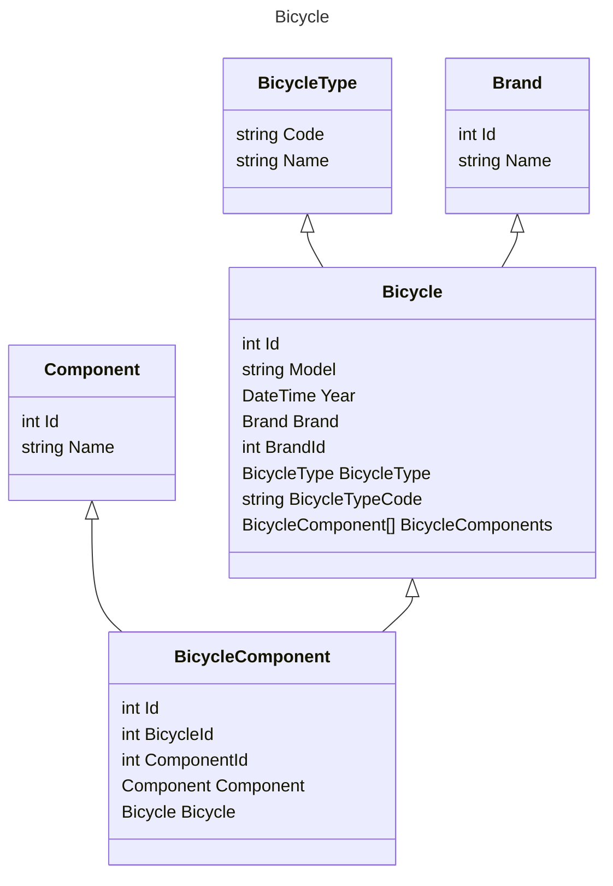

```mermaid
---
title: Bicycle
---
classDiagram
    BicycleType <|-- Bicycle
    Component <|-- BicycleComponent
    Bicycle <|-- BicycleComponent
    Brand <|-- Bicycle

    class BicycleType{
        string Code
        string Name
    }
    class BicycleComponent{
        int Id
        int BicycleId
        int ComponentId
        Component Component
        Bicycle Bicycle
    }
    class Component{
        int Id
        string Name
    }
    class Brand{
        int Id
        string Name
    }
    class Bicycle{
        int Id
        string Model
        DateTime Year
        Brand Brand
        int BrandId
        BicycleType BicycleType
        string BicycleTypeCode
        BicycleComponent[] BicycleComponents
    }
```

